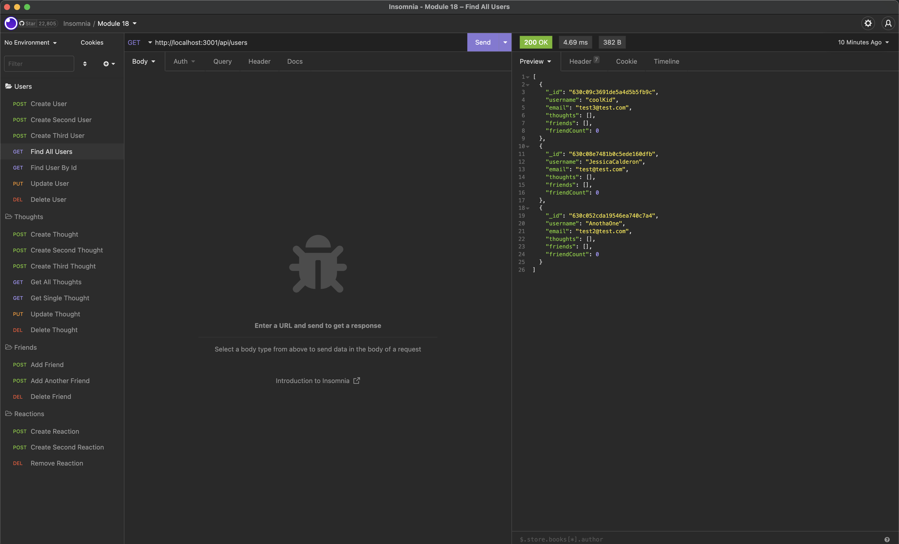

# Vybit

## Table of Contents
* [Description](#description)
* [Built With](#languages)
* [Installation](#installation)
* [Contributing](#contributing)
* [Usage](#usage)
* [Testing](#tests)
* [Questions](#questions)
* [Application Preview](#application-preview)

## [Description](#table-of-contents)
A back-end API for a social network in which users can manage thoughts, reactions, and friends. 

## [Languages](#table-of-contents)
JavaScript, Node.js, MongoDB, Mongoose, NoSQL

## [Usage](#table-of-contents)
Users can create, delete, and update user accounts. Create, update, and delete thoughts and reactions, and add or remove friends via API database at `localhost:3001/api` with future implementation for a front-end social media network.
## [Contributing](#table-of-contents)

Thank you for your interest in contributing to this project, however, I am currently not accepting third party contributions.

## [Installation](#table-of-contents)
`https://github.com/jessica-calderon/vybit`

`npm i`

`npm run start`

`localhost:3001/api`

## [Application Preview](#table-of-contents)
Click the image to see the live demo.

## [Questions](#table-of-contents)
Questions? Please contact me at the following links:  
[GitHub](https://github.com/jessica-calderon)  
[Email: calderonjessica13@yahoo.com](mailto:calderonjessica13@yahoo.com)
